[목요일] 헤드퍼스트 디자인패턴

## 요약

SimUDuck 시나리오 (마무리)

동적으로 행동을 지정하도록 하자. 기존에는 생성자에서 인스턴스를 만들면서 행동을 지정하였다. 그러지 말고 setter 메소드를 사용하여 행동을 설정 할 수 있도록 하자. ([Duck.java](../../headfirst-designpatterns/SimUDuck/src/Duck.java), [MiniDuckSimulator.java](../../headfirst-designpatterns/SimUDuck/src/MiniDuckSimulator.java))

실행 결과
```
꽥
날고 있어요!!
저는 못 날아요
로켓 추진으로 날아갑니다
```

> 두 클래스를 합치는 방법
>> "A는 B이다"보다 "A에는 B가 있다"가 나을 수 있다.

두 클래스를 합치는 것을 '구성(composition)을 이용한다'라고 부른다. SimUDuck 시나리오에서 오리 클래스에서는 행동을 상속받는 대신, 올바른 행동 객체로 구성되어 행동을 부여받았다.


> #### 📘 전략 패턴
> 
> **전략 패턴**(Strategy Pattern)은 알고리즘군을 정의하고 캡슐화해서 각각의 알고리즘군을 수행해서 쓸 수 있게 해준다. 전략 패턴을 사용하면 클라이언트로부터 알고리즘을 분리해서 독립적으로 변강할 수 있다.

우리는 SimUDuck 시나리오를 전략 패턴을 사용하여 해결했다. 다른 요구사항으로 행동을 바꿔 달라고 하더라도 문제가 되지 않을거다.

</br>

__전문 용어__\(_디자인 패턴_\)을 사용하면 더 효율적인 의사소통을 할 수 있다(매끄럽고 명확하다).

디자인 패턴은 라이브러리와 프레임워크를 쉽게 이해할 수 있게 하며, 유지보수 하기 좋은 애플리케이션의 구조를 설계하는데 도움이 된다.

> 디자인 패턴을 배우기전 사전 지식
>
>> 객체지향 기초
>> * 추상화
>> * 캡슐화
>> * 다향성
>> * 상속
>
>> 객체지향 원칙
>> * 바뀌는 부분은 캡슐화한다.
>> * 상속보다 구성을 활용한다.
>> * 구현보다는 인터페이스에 맞춰서 프로그래밍한다.
>
>> 객체지향 패턴
>>
>> __전략패턴__
>>> 전략 패턴은 알고리즘군을 정의하고 캡슐화해서 각각의 알고리즘군을 수정해서 쓸 수 있게 해준다. 전략 패턴을 사용하면 클라이언트로부터 알고리즘을 분리해서 독립적으로 변경할 수 있다.

</br>

## 발췌

디자인 원칙

> 상속보다는 구성을 활용한다.

</br>

핵심 정리

* 객체지향 기초 지식만 가지고는 훌륭한 객체지향 디자이너가 될 수 없다.
* 훌륭한 객체지향 디자인이라면 재사용성, 확장성, 관리의 용이성을 갖출 줄 알아야 한다.
* 패턴은 훌륭한 객체지향 디자인 품질을 갖추고 있는 시스템을 만드는 방법을 제공한다.
* 패턴은 검증받은 객체지향 경험의 산물이다.
* 패턴이 코드를 바로 제공하는 것은 아니다. 디자인 문제의 보편적인 해법을 제공한다. 특정 애플리케이션에 패턴을 적용하는 일은 우리가 해야 한다.
* 패턴은 발명되는 것이 아니라 발견되는 것이다.
* 대부분의 패턴과 원칙은 소프트웨어의 변경 문제와 연관되어 있다.
* 대부분의 패턴은 시스템의 일부분을 나머지 부분과 무관하게 변경하는 방법을 제공한다.
* 대부분의 경우 시스템에서 바뀌는 부분을 골라내서 캡슐화해야 한다.

</br>

## 메모

디자인 퍼즐 - 61 페이지



낱말 퀴즈 - 69 페이지


