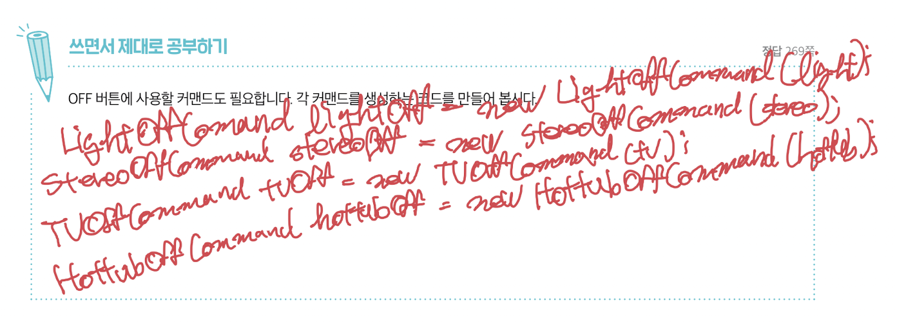
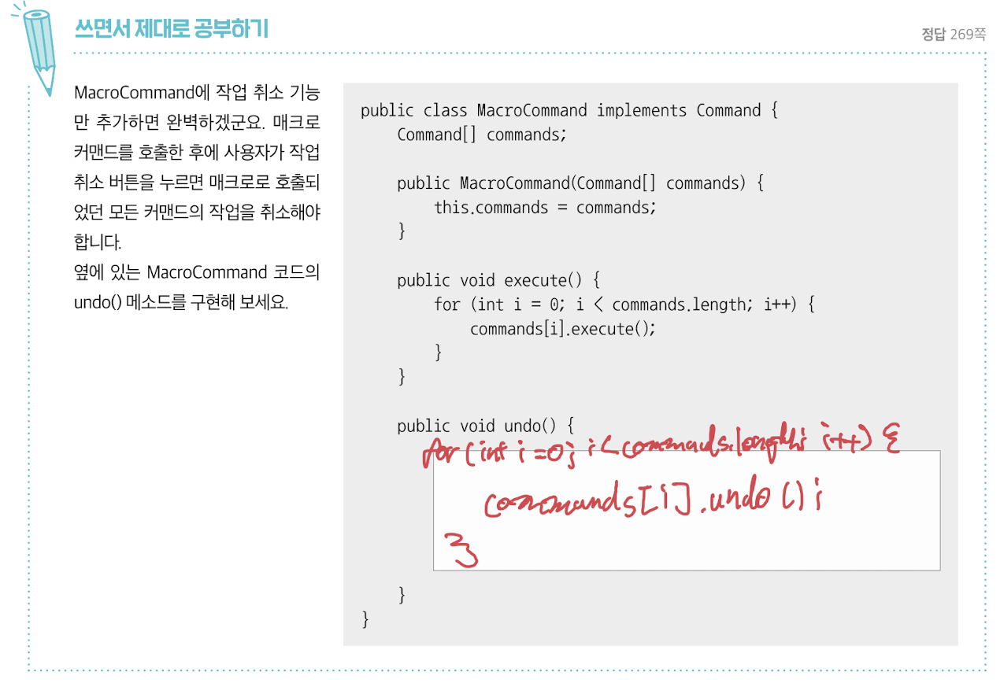

[월요일] 헤드퍼스트 디자인패턴

## 요약

### 주식회사 홈 오토메이션 시나리오 (이어서...)

#### 선풍기 테스트 코드 만들기

[RemoteLoader.java](../../headfirst-designpatterns/CommandPattern/IOTRemoteControlAddCeilingFan/src/RemoteLoader.java)

테스트 결과

```
Living Room 선풍기 속도가 MEDIUM으로 설정되었습니다
Living Room 선풍기가 꺼졌습니다

-------- 리모컨 -------
[slot 0] CeilingFanMediumCommand   CeilingFanOffCommand
[slot 1] CeilingFanHighCommand   CeilingFanOffCommand
[slot 2] NoCommand   NoCommand
[slot 3] NoCommand   NoCommand
[slot 4] NoCommand   NoCommand
[slot 5] NoCommand   NoCommand
[slot 6] NoCommand   NoCommand
[undo] CeilingFanOffCommand

Living Room 선풍기 속도가 MEDIUM으로 설정되었습니다
Living Room 선풍기 속도가 HIGH로 설정되었습니다

-------- 리모컨 -------
[slot 0] CeilingFanMediumCommand   CeilingFanOffCommand
[slot 1] CeilingFanHighCommand   CeilingFanOffCommand
[slot 2] NoCommand   NoCommand
[slot 3] NoCommand   NoCommand
[slot 4] NoCommand   NoCommand
[slot 5] NoCommand   NoCommand
[slot 6] NoCommand   NoCommand
[undo] CeilingFanHighCommand

Living Room 선풍기 속도가 MEDIUM으로 설정되었습니다
```

#### 매크로 커맨드 사용하기

여러 동작을 한 번에 처리해보자.

[MacroCommand.java]()

</br>

#### 커맨드 패턴 활용하기

커맨드로 컴퓨테이션(computation)의 한 부분(리시버와 일력의 행동)을 패키지로 묶어서 일급 객체 형태로 전달 가능하다. 클라이언트 애플리케이션에서 커맨드 객체를 생성 후 나중에 그 컴퓨테이션을 호출 할 수 있다. 이 특징을 살려 _커맨드 패턴을 스케줄러나 스레드 풀, 작업 큐과 같은 다양한 작업_ 에 적용 가능하다.

커맨드 패턴을 사용하여 store()와 load() 메소드를 추가해서 모든 행동을 기록해 두었다가 애플리케이션이 다운되었을 때 그 행동을 다시 호출하도록 할 수 있다.

</br>

## 발췌

디자인 도구상자 안에 들어가야 할 도구들

객체지향 패턴 | 커맨드 패턴 - 요청 내역을 객체로 캡슐화해서 객체를 서로 다른 요청 내역에 따라 매개변수화할 수 있다. 이러면 요청을 큐에 저장하거나 로그로 기록하거나 작업 취소 기능을 사용할 수 있다. (new)

</br>

## 메모

쓰면서 제대로 공부하기 - 260 페이지



쓰면서 제대로 공부하기 - 262 페이지



낱말 퀴즈 - 267 페이지