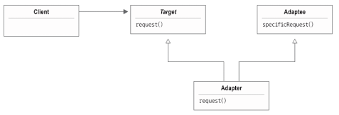
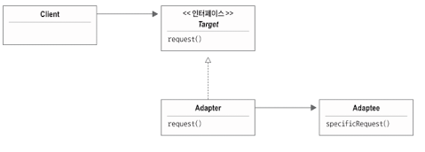

[화요일] 헤드퍼스트 디자인패턴

## 요약

### 어댑터 패턴

한국에서 사용하는 전원 콘센트를 영국에서 사용하려면 콘센트 모양을 바꿔주는 어댑터가 필요하다.

객체지향에서도 A 객체와 B 객체를 사용할 수 있게 중간에서 바꿔주는 _객체지향 어댑터_ 를 사용할 수 있다.

어댑터 사용 방법을 알아보자

Duck 인터페이스 ([Duck.java]())

MallardDuck 클래스 ([MallardDuck.java]())

새로운 칠면조(Turkey) 클래스 ([Turkey.java]())

칠면조는 오리가 아니기 때문에 `quack()` 이 없다. Turkey 객체를 Duck에서 사용할 수 없으므로 중간에 어댑터를 만들어보자.

[TurkeyAdapter.java]()

오리 어댑터 테스트 ([DuckTestDrive.java]()) :

```
```

#### 객체 어댑터와 클래스 어댑터

어댑터 패턴의 종류:

* 객체 어댑터

* 클래스 어댑터

> 자바에서는 다중 상속이 불가능하므로 클래스 어댑터를 언급하지 않았지만, 다른 언어에서 사용할 수 있으니 알아두자.

__클래스 어댑터__



__객체 어댑터__



객체지향 어댑터 알아보기

어댑터 사용 방법 알아보기

오리 어댑터 테스트

어댑터 패턴 알아보기

어댑터 패턴의 정의

</br>

## 발췌

> __어댑터 패턴(Adapter Pattern)__ 은 특정 클래스 인터페이스를 클라이언트에서 요구하는 다른 인터페이스로 변환한다. 인터페이스가 호환되지 않아 같이 쓸 수 없었던 클래스를 사용할 수 있게 도와준다.

</br>

## 메모

쓰면서 제대로 공부하기 - 278 페이지

오리 자석 - 281 페이지