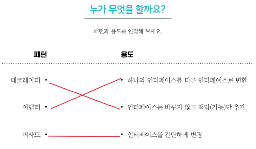

[수요일] 헤드퍼스트 디자인패턴

## 요약

### 어댑터 패턴 (이어서...)

#### 실전 적용! 어댑터 패턴

자바의 Enumeration, Iterator를 사용하여 어댑터 패턴을 적용해보자. ([EnumerationIterator.java](../../headfirst-designpatterns/AdapterPattern/EnumerationAndIterator/src/EnumerationIterator.java))

 

## 발췌

 

## 메모

쓰면서 제대로 공부하기 - 287 페이지

누가 무엇을 할까요? - 290 페이지

