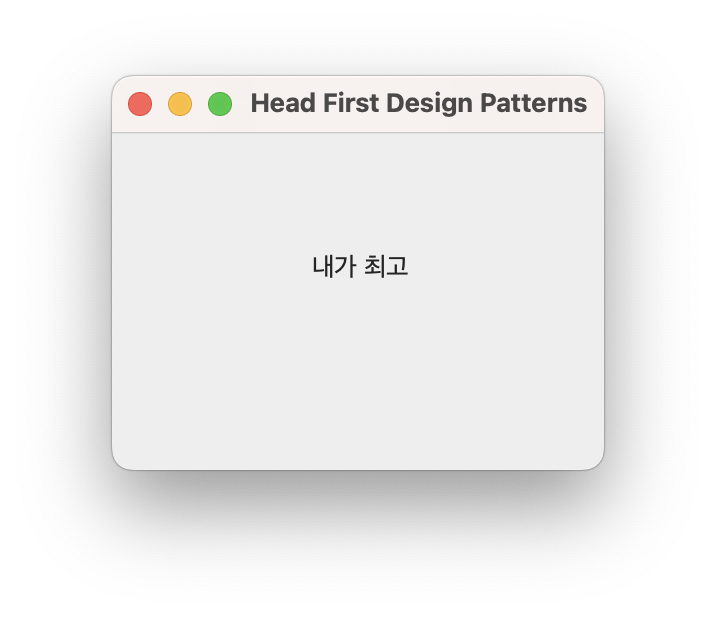

[월요일] 헤드퍼스트 디자인패턴

## 요약

오리 배열 속 오리들을 정렬해보자. 오리 비교 방법은 compareTo() 메소드로 구현하는 거다. [Duck.java](../../headfirst-designpatterns/TemplateMethodPattern/DuckSort/src/Duck.java)

오리 정렬 코드 테스트([DuckSortTestDrive.java](../../headfirst-designpatterns/TemplateMethodPattern/DuckSort/src/DuckSortTestDrive.java))

```
정렬 전:
Daffy체중: 8
Dewey체중: 2
Howard체중: 7
Louie체중: 2
Donald체중: 10
Huey체중: 2

정렬 후:
Dewey체중: 2
Louie체중: 2
Huey체중: 2
Howard체중: 7
Daffy체중: 8
Donald체중: 10
```

다음은, 템플릿 메소드로 그래픽을 출력해보자. [MyFrame.java](../../headfirst-designpatterns/TemplateMethodPattern/GraphicPrint/src/MyFrame.java)



다음은, AbstractList로 나만의 리스트를 만들어보자. [MyStringList.java](../../headfirst-designpatterns/TemplateMethodPattern/MakeMyStringList/src/MyStringList.java)

</br>

## 발췌

</br>

## 메모
